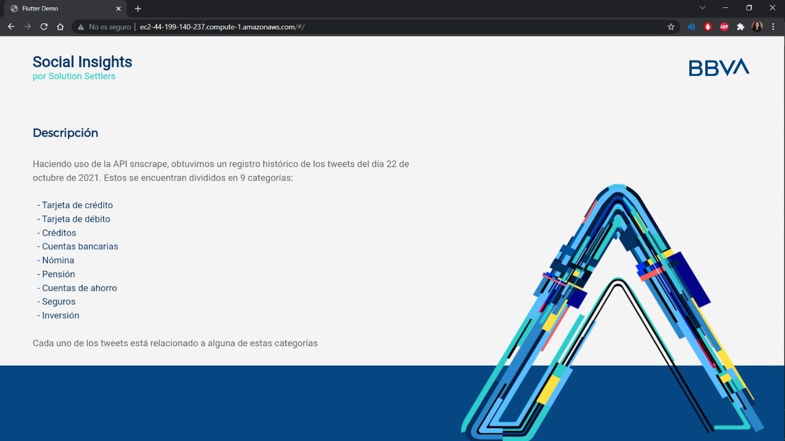

# Social Insights
> Proyecto realizado para el reto: BBVA Contigo del Hackathon BBVA 2021

## Descripción general 🎯
Se propone *Social Insights*, una aplicación web que permite observar la relación que existe entre los productos y las problemáticas planteadas por los usuarios de las redes sociales, buscando ofrecer soluciones que sean capaces de satisfacer necesidades para atraer nuevos clientes.

La estrategia a implementar será escuchar la red social Twitter, segmentando los datos extraídos usando palabras claves tales como: créditos, tarjetas, préstamos, entre otras. Realizar un análisis en el pasado y su relación con soluciones para predecir sobre el futuro gracias a un modelo predictivo creado a partir de los datos recopilados. 

Básicamente, analizar el pasado para predecir el futuro. Dicha solución se centra en 9 ejes principales en 3 países: México, España y Colombia; siendo nuestra solución escalable a todos los servicios y a todas las regiones en las cuales tiene presencia BBVA. Se busca ayudar a los clientes en la transición hacia un futuro sostenible, crecer en clientes y escalar en la  excelencia operativa. 

## Descripción tecnológica ⚙️

*Social Insights* es desarrollado en Flutter bajo un modelo MVC. La aplicación Web provee información necesaria para mostrar en el Fron-End. Tiene un apartado que muestra cuantitativamente en una gráfica la cantidad de palabras clave mencionadas en los tweets obtenidos (dichas palabras clave fueron seleccionadas tomando en cuenta los servicios ofrecidos por BBVA), además de una tabla con la información de dichos tweets para poder verificarlos con mayor detalle.

Los datos fueron extraídos gracias al uso de la librería snscraper, el procesamiento de datos es realizado con Python y el análisis de sentimiento consumiendo servicios de AWS, tales como AWS Translate y AWS Comprehend. 

## Autores ✒️

* Ervey Guerrero - _Amazon Web Services, Sentiment analysis, Research_ - [ErveyG](https://github.com/ErveyG)
* Fernando Contreras - _Web development, Design_ - [fershous](https://github.com/fershous)
* Alondra Sánchez - _Data processing, NLP, Research, Documentation_ - [alondraSanchezM](https://github.com/alondraSanchezM)
* Elias Rodriguez - _Web development, Documentation_ - [EliasRodriguezChimal](https://github.com/EliasRodriguezChimal)
* Gabriel Camacho - _Documentation, Design_ - [Tato-Camacho](https://github.com/Tato-Camacho)

## Sitio Web :computer:
* Puede visualizar la solución implementada [aquí](http://ec2-44-199-140-237.compute-1.amazonaws.com/).
* [Pitch en video](https://youtu.be/ARMBmLue9eA)

---
##### Por **Solution Settlers** :bulb: